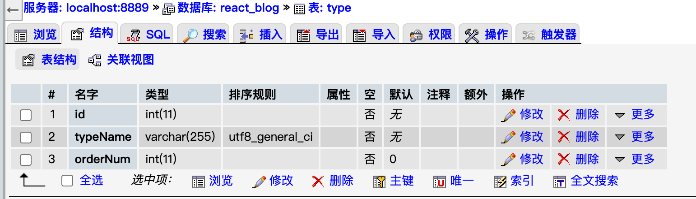

#### 0、项目介绍

整个项目会包括三个部分：

- BLOG前台（UI）：用户使用、博客展览
- 接口中台：数据接口、业务逻辑
- 后台管理：文章类别管理、系统设置


#### 1、Blog前台开发（SSR）

- 技术：react hooks、next框架、antd组件

  前端主要完成功能就是用户的访问，文章列表和文章详情页面。因为Blog的前台需要SEO操作，所以我们会选用`Next.js`框架来辅助我们开发。然后减少CSS和各种组件的重复开发，选用阿里的`Ant Desgin`来作为UI交互库.


##### 1.1 Header组件

- antd组件：Row、Col（24格栅格化的技术适配不同终端）、Menu、Icon


##### 1.2 主体两栏布局

- antd组件：Row、Col

##### 1.3 博客列表

- antd组件：List、Breadcrumb

##### 1.4 右侧组件

- antd组件：Avatar,Divider，包括个人信息介绍组件、广告组件

##### 1.5 markdown解析——博客详情页

- 使用 react-markdown
- 文章目录显示使用 markdown-navbar
- 文章目录导航要一直在页面的右侧。我们经常叫这个需求为`固钉`。`Ant Desgin`中提供了`Affix`.

##### 1.6  前端重构——改markdown解析

- Marked + highlight

##### 1.7 前端重构——文章导航


#### 2、中台搭建(数据接口)

博客系统的服务端（或者叫做中台），采用Koa的上层框架egg.js，所谓上层框架就是在Koa的基础上，封装的框架。

##### 2.1 开发环境搭建

全局安装`egg.js`的脚手架工具`egg-init`：

```
npm i egg-init -g
```

用脚手架自动生成项目的基本结构，在终端中直接输入下面的命令。

```
egg-init --type=simple
```

使用命令安装egg项目所需要的所有依赖包。

```
npm install
```

安装完成后，就可以启动服务查看一下结果了。

```
npm run dev
```

##### 2.2 egg.js的目录结构和约定规范

- **app文件夹**:项目开发文件，程序员主要操作的文件，项目的大部分代码都会写在这里。
- **config文件夹**：这个是整个项目的配置目录，项目和服务端的配置都在这里边进行设置。
- logs文件夹：日志文件夹，正常情况下不用修改和查看里边内容。
- node_modules:项目所需要的模块文件，这个前端应该都非常了解，不多作介绍。
- run文件夹：运行项目时，生成的配置文件，基本不修改里边的文件。
- test文件夹：测试使用的配合文件，这个在测试时会使用。
- .autod.conf.js: egg.js自己生成的配置文件，不需要进行修改。
- eslinttrc和eslintignore：代码格式化的配置文件。
- gitgnore：git设置忽略管理的配置文件。
- **package.json**： 包管理和命令配置文件，这个文件经常进行配置

在app目录下，egg要求我们必须要有下面的文件:

- **controller文件夹**：控制器，渲染和简单的业务逻辑都会写道这个文件里。配置路由时也会用到（路由配置需要的文件都要写在控制器里）。
- **public文件夹**：公用文件夹，把一些公用资源都放在这个文件夹下。
- **router.js**: 项目的路由配置文件，当用户访问服务的时候，在没有中间件的情况下，会先访问router.js文件。
- service文件夹：这个是当我们的业务逻辑比较复杂或和数据库打交道时，会把业务逻辑放到这个文件中。
- view文件夹：模板文件夹，相当于表现层的专属文件夹，这个项目，我们使用接口的形式，所以不需要建立view文件夹。
- extend文件：当我们需要写一些模板中使用的扩展方法时，我们会放到这个文件夹里。
- middleware：中间件文件夹，用来写中间件的，比如最常用的路由守卫

##### 2.3 RESTful API设计简介和路由配置

中台只提供接口，接口的设计采用`RESTful`的规则，让egg为前端提供Api接口，实现中台主要的功能。

###### RESTful简介和约束方式

RESTful是目前最流行的网络应用程序设计风格和开发方式，大量使用在移动端App上和前后端分离的接口设计。这种形式更直观并且接口也有了一定的约束性。

约束的请求方式和对应的操作。

- **GET(SELECT)** ： 从服务端取出资源，可以同时取出一项或者多项。
- **POST(CREATE)** ：在服务器新建一个资源。
- **PUT(UPDATE)** ：在服务器更新资源（客户端提供改变后的完整资源）。
- **DELETE(DELETE)** ：从服务器删除资源。

##### 2.4 在egg.js中Api接口的路由配置

- 首先打开`service`根目录下的`controller`文件夹,新建两个文件夹admin（管理端使用的所有API接口）和default（客户端使用的所有API接口）文件夹

- 路由也分成前后端分离的，在`app`文件夹下新建一个`router`文件夹,新建两个文件`default.js`和`admin.js`

  


##### 2.5 Egg.js中连接mysql数据库

- 先进行安装`egg-mysql`模块

```
npm i egg-mysql --save
```

- 插件配置

  - 文件/server/config/plugin.js

    ```js
    exports.mysql = {
      enable: true,
      package: 'egg-mysql'
    }
    ```

- 数据库连接配置

  - 使用了MAMP集成开发环境中的mysql
  
  - 打开/config/config.default.js文件，作下面的配置
  
    ```js
    config.mysql = {
        // database configuration
        client: {
          // host
          host: 'localhost',
          // port
          port: '8889',
          // username
          user: 'root',
          // password
          password: 'root',
          // database
          database: 'react_blog',    
        },
        // load into app, default is open
        app: true,
        // load into agent, default is close
        agent: false,
      };
    ```
  
-  数据库连接测试

  打开`/app/controller/defalut/home.js`文件，使用get进行表的查询

  ```js
  'use strict';
  const Controller = require('egg').Controller
  class HomeController extends Controller{
      async index(){
          //获取用户表的数据
  
          let result = await this.app.mysql.get("blog_content",{})
          console.log(result)
          this.ctx.body=result
      }
  }
  module.exports = HomeController
  ```

  

- 数据库中表的设计

  

  

##### 2.6 利用RESTful的规范，建立前端首页所需要的接口

```javascript
async getArticleList() {
        let sql = 'SELECT article.id as id,'+
             'article.title as title,'+
             'article.introduce as introduce,'+
             'article.addTime as addTime,'+
             'article.view_count as view_count ,'+
             '.type.typeName as typeName '+
             'FROM article LEFT JOIN type ON article.type_id = type.Id';

        const results = await this.app.mysql.query(sql);
        this.ctx.body={
            data:results
        }
    }
```


##### 2.7  在getInitialProps中用Axios获取远端数据

在`Next.js`框架中提供了`getInitialProps`静态方法用来获取远端数据，这个是框架的约定。

```javascript
Home.getInitialProps = async ()=>{
  const promise = new Promise((resolve)=>{
    axios('http://127.0.0.1:7001/default/getArticleList').then(
      (res)=>{
        // console.log('远程数据结果：',res.data.data)
        resolve(res.data)
      }
    );
  });

  return await promise;
};
```

**把数据放入到界面中**

```javascript
const [myList,setMylist] = useState(props.data);
```


**文章详情页面制作**

- 编写中台详情页面接口

  - 打开`/service/app/controller/default/home.js`文件，编写接口

  - 接口是需要接收文章ID，然后根据文章ID查出内容的

  - ```js
    先配置路由的动态传值
    router.get('/default/getArticleById/:id', controller.default.home.getArticleById);
    ```

- 编写前端导航链接

  - 直接使用Next.js中的`<Link>`标签

    ```javascript
     <Link href={{pathname:'/detailed',query:{id:item.id}}}>
          {item.title}
     </Link>
    ```

  - 通过链接跳转到详细页面之后，就可以编写`detailed.js`，通过`getInitialProps`来访问中台接口，并从中台接口获得数据

    ```javascript
    Detailed.getInitialProps = async (context)=>{
      let id = context.query.id;
      const promise = new Promise((resolve)=>{
        axios('http://127.0.0.1:7001/default/getArticleById/'+id).then(
          (res)=>{
            // console.log(res);
            resolve(res.data.data[0]);
          }
        );
      });
      return await promise;
    }
    ```

  ##### 2.8 解决egg.js的跨域问题

  `egg-cors`模块是专门用来解决`egg.js`跨域问题的

  - 安装

    ```
    npm i egg-cors --save
    ```

  - config/plugin.js

  - config.default.js

    这个文件主要设置的是允许什么域名和请求方法可以进行跨域访问

    ```javascript
    　config.security = {
    　　　　csrf: {
    　　　　　　enable: false
    　　　　},
    　　　　domainWhiteList: [ '*' ]
    　　};
     config.cors = {
        origin: '*',
        allowMethods: 'GET,HEAD,PUT,POST,DELETE,PATCH,OPTIONS'
    };
    ```

##### 2.8 编写统一中台API配置文件

/config/apiUrl.js

```javascript
let ipUrl = 'http://127.0.0.1:7001/default/';

let servicePath = {
    getArticleList:ipUrl + 'getArticleList' ,  //  首页文章列表接口
    getArticleById:ipUrl + 'getArticleById/',  // 文章详细页内容接口 ,需要接收参数
};

export default servicePath;
```

##### 2.9 根据类别读取文章列表

- 中台编写接口
  - 配置路由动态传参
  - 编写方法，获取路由参数查询数据库并将结果返回
- 前台跳转列表页时调用接口
  - 配置路由动态传参
  - 页面初始化时获取参数调用接口拿到数据

##### 2.10【问题】

使用了antd中的Menu组件，在不同list间切换时变成了单页应用，而不是从服务端渲染的。通过前端单页的变化来访问后端数据。

全站不是纯SSR渲染


### 中台跨域

借用插件**egg-cors**

设置白名单


#### 3、后台管理

- 技术栈：

  create-react-app搭建基本框架——单页应用，react hook + antd实现，不需要使用服务端渲染框架（next）（不需要SEO）

##### 3.1 路由配置

- React-router-dom

  ```javascript
  import {BrowserRouter as Router,Routes,Route} from 'react-router-dom';
  
  import Login from './Login';
  
  function Main(){
      return (
          <div>
              <Router>
                  <Routes>
                      <Route path='/index' element={<Login/>}></Route>
                  </Routes>
              </Router>
          </div>
      ); 
  }
  
  export default Main;
  ```

##### 3.2 登录框制作

- antd组件 ：Input、Button、Spin、Card

##### 3.3 后台页面布局

- antd组件：Layout（侧栏布局）

##### 3.4 添加文章页面制作

- antd组件：Row、Col、Input、Button、DatePicker

- markdown交互式解析：marked


##### 3.5 中台登录接口编写

- 建表admin_user

- 接口/admin/checkLogin

  ```javascript
  async checkLogin(){
          console.log('**',this.ctx.request);
          let userName = this.ctx.request.body.userName
          let password = this.ctx.request.body.password
          const sql = " SELECT userName FROM admin_user WHERE userName = '"+userName +
                      "' AND password = '"+password+"'"
  
          const res = await this.app.mysql.query(sql)
          if(res.length>0){
              //登录成功,进行session缓存
              let openId=new Date().getTime()
              console.log('**session',this.ctx.session);
              this.ctx.session.openId={ 'openId':openId }
              this.ctx.body={'data':'登录成功','openId':openId}
  
          }else{
              this.ctx.body={data:'登录失败'}
          } 
    }
  ```

##### 3.6 登录功能实现

- 后台页面点击按钮axios发送post请求
- 中台服务器配置跨域请求、允许cook可以跨域

##### 3.7 中台路由守卫

- 以中间件的形式进行登录验证

  app/middleware/adminauth.js里

- 路由配置中引入声明中间件，放入路由配置的第二个参数

##### 3.8 路由守卫+读取文章分类信息

- 中台编写读取文章类型接口
- 中台配置访问该接口路由时，加入路由守卫
- 路由守卫根据请求头中的sessionid判断当前是否已经登录

##### 3.9 添加文章功能

- 前台必要内容检验
- 中台编写添加文章接口（insert）
- 中台编写更新文章接口（update）

##### 3.10 文章列表制作

- 后台列表页面
  - antd组件：List、Modal、message、Button
  - 配置路由
- 中台编写获取文章列表接口（query）

##### 3.11 删除文章

- 中台编写根据id删除文章接口（delete）
- 后端点击按钮调用接口，配置路由动态传参

##### 3.12 修改文章

- 中台编写根据id获取文章接口（query）

- 后台配置路由（传参数id），跳转至addArticle.js页面处理

- addArticle.js页面获取路由参数id，初次加载时若能够获取参数id，则获取值并显示文章详情

  ```javascript
  						<Router>
                  <Routes>
                      <Route path='/' element={<Login/>}></Route>
                      <Route path='/index' element={<AdminIndex/>}>
                          <Route path='/index/' element={<AddArticle/>}></Route>
                          <Route path='/index/addArticle' element={<AddArticle/>}></Route>
                          <Route path='/index/addArticle/:id' element={<AddArticle/>}></Route>
                          <Route path='/index/list' element={<ArticleList/>}></Route>
                      </Route>
                  </Routes>
              </Router>
  ```


#### 4、项目部署

https://blog.csdn.net/LuckyWinty/article/details/111659348

##### 4.1 项目结构

- blog

  博客项目前端工程，所用技术栈为Next.js + React Hooks + Antd + Axios
  
- service

  博客项目后端服务，所用技术栈为Egg.js

- admin

  博客后台管理系统，所用技术栈为Create-React-App + React Hooks + Antd + Axios

##### 4.2 部署前准备

- 购买阿里云云服务器
  - 获取公网IP 39.105.96.121 

##### 4.3 服务器环境搭建——mysql数据库

```
sudo apt-get update
apt install mysql-server

```

##### 4.4 服务器环境搭建——nodejs、Pm2

```
sudo apt update
sudo apt install nodejs （默认8.10.0版本 太低了）
sudo apt install npm 

// 升级node
sudo npm install -g n
sudo n stable 下载稳定版
sudo n x.x.x  选择指定版本node
sudo npm i -g npm 升级npm

npm install -g pm2

```


##### 4.5 服务器环境搭建——Nginx

```
sudo apt-get install nginx

```

##### 4.6 服务器环境搭建——开启ssh服务，上传代码

```
sudo apt install openssh-server
sudo service ssh start
检查是否启动成功： ps -aux | grep ''ssh''

scp -r react_Blog root@39.105.96.121:/home/web/
```

##### 4.7 服务器环境搭建——运行项目

```
在运行项目之前，先确保各个项目的node_modules依赖是否成功安装完成。

【运行blog】
1、进入到blog文件夹
2、PM2来启动并守护项目进程
pm2 start npm --name 自定义进程名 -- run start
pm2 list
pm2 show 进程id

【运行service】
egg.js框架内置的egg-scripts命令不需要pm2进程守护，直接在服务器可通过执行npm start或npm stop来启动和停止后端服务。

【运行admin】
1、执行 npm run build来打包生成生产环境所用的静态资源文件，默认生成在admin的bulid文件夹下
2、利用nginx设置一个静态站点

【Nginx配置】
1、nginx会对各个项目进行端口监听配置，请先确保一些必要的服务器端口（如网站首页默认80端口，mysql数据库端口3306）是否已开放使用。
以阿里云为例，它的端口配置是通过服务器实例-安全组规则配置中进行设置的。此外，我们还应该新增开放一些端口（端口号可自定义）来用于nginx配置各项目进程端口代理转发
2、修改配置文件
配置server...不太会
```

